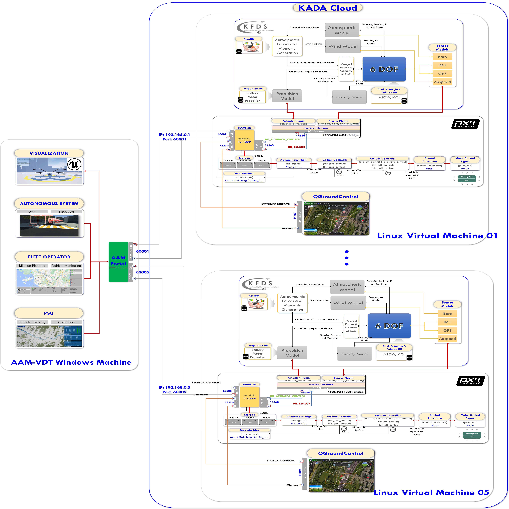

<span style="font-family: times, serif; font-size:10pt; font-style:italic; color:red"> May 12, 2024 </span>

# <span style="font-family: times, serif; font-size:10pt; font-style:italic; color:red"> Advanced Air Mobility-Vehicle Digital Twin (AAM-VDT) </span>

Excited to share our achievements after a year of leading the AAM-VDT project at Konkuk Aerospace Design-Airworthiness Institute (KADA). We've made significant progress in developing an integrated simulation platform for the Konkuk Passenger Vehicle (KP-2) digital twin in the Advanced Air Mobility (AAM) sector. Our focus on cutting-edge technologies has paved the way for a revolutionary system in urban air mobility.

The Advanced Air Mobility-Vehicle Digital Twin (AAM-VDT) project integrates cloud computing, artificial intelligence, and simulation to manage heterogeneous vehicles in real-time. Our collaboration within the KADA Research Groups - Design and Analysis, Simulation and Control, and AI Applications - has been instrumental in achieving our goals.

Our key features include cloud server integration, AI-driven operations, digital twin technology, and a strong emphasis on operational safety and management. By utilizing digital twin dynamics, ensuring safety and reliability, and implementing multi-vehicle coordination, we are shaping the future of AAM operations.

## Medias

- VDT Simulation System: <https://lnkd.in/g4Q9SEKM>
- VDT Concept Illustration: <https://lnkd.in/gYb5yESg>
- VDT Simulation in KU Map (01): <https://lnkd.in/g_pYmn9T>
- VDT Simulation in KU Map (02): <https://lnkd.in/gPGNAHCG>
- VDT Simulation in KU Map (03)-JS Transition Scheduling Algorithm: <https://lnkd.in/gb24sZsy>
- VDT Simulation in Seoul Map (Fixed Wing): <https://lnkd.in/gSJ-sFeM>
- VDT Simulation Scenarios: <https://lnkd.in/gTzbUa85>
- KP2C Real Flight Test: <https://lnkd.in/gpkBcx4i>
- KP2C es-DNLC Flight Test: <https://lnkd.in/g92NiTKz>
- KP2C LQR Flight Test: <https://lnkd.in/gR8q7zXD>

Special thanks to our diligent KADA engineers and researchers! Jeongseok Hyun, Minseok Jang, Vinh Pham, AYE AYE MAW

Excited about the possibilities that lie ahead as we continue to innovate and drive advancements in the realm of Advanced Air Mobility. #AAM #UAM #DigitalTwin #AI #CloudComputing

```html
<html lang="en">
<head>
    <meta charset="UTF-8">
    <meta name="viewport" content="width=device-width, initial-scale=1.0">
    <title>Gallery of Images</title>
    <style>
        figure {
            text-align: center;
            margin: 20px;
        }
        figcaption {
            color: blue;
        }
        img {
            width: 80%;
            height: auto;
        }
    </style>
</head>
<body>
    <figure>
        
        <figcaption>VDT Simulation System</figcaption>
    </figure>
    <figure>
        
        <figcaption>VDT Techs</figcaption>
    </figure>
    <figure>
        
        <figcaption>VDT-CILS Resized</figcaption>
    </figure>
    <figure>
        
        <figcaption>VDT-CILS</figcaption>
    </figure>
    <figure>
        
        <figcaption>VDT Single ODT</figcaption>
    </figure>
    <figure>
        
        <figcaption>VDT SITL Simplified</figcaption>
    </figure>
    <figure>
        
        <figcaption>VDT SITL</figcaption>
    </figure>
</body>
</html>
