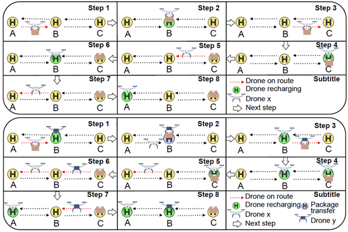
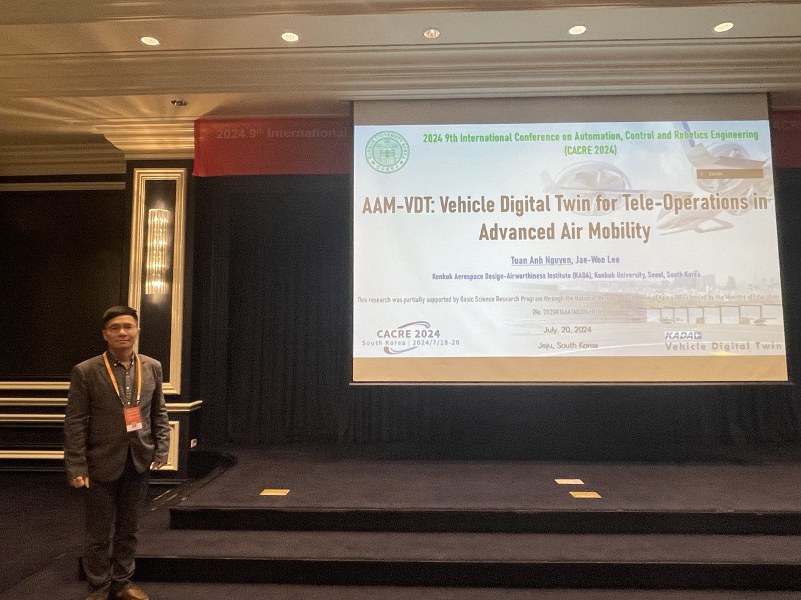
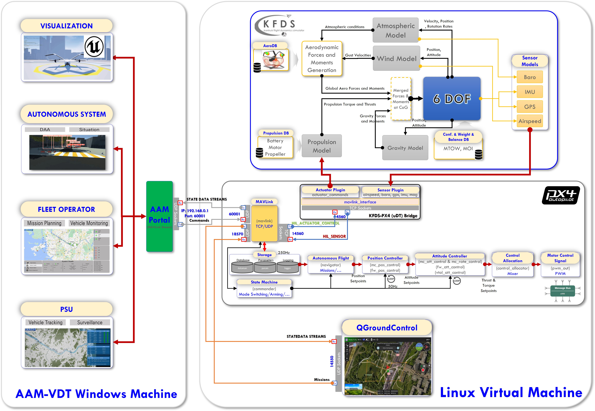
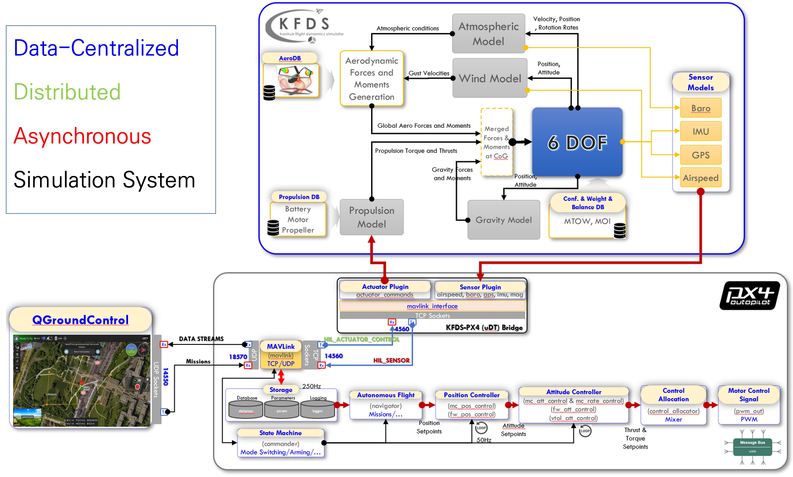
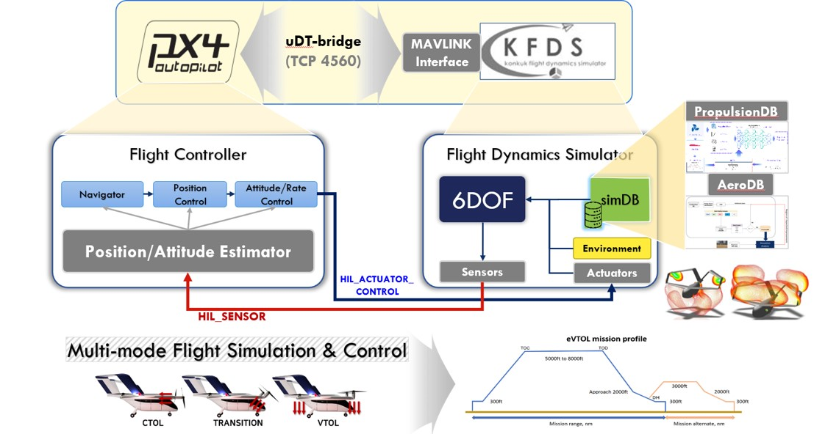

<html lang="en">
<head>
    <meta charset="UTF-8">
    <meta name="viewport" content="width=device-width, initial-scale=1.0">
    <title>News</title>
    
</head>
</html>

--------------------------------------
 August 28, 2024 

🚀 **Exciting News in Drone Delivery Tech!** 🚀

We just explored a groundbreaking study titled **"Efficient Strategies for Unmanned Aerial Vehicle Flights: Analyzing Battery Life and Operational Performance in Delivery Services using Stochastic Models"** published in *IEEE Access*. This research, conducted by Francisco Airton Silva, Vandirleya Barbosa, Luiz Nelson Lima, Arthur Sabino, Paulo Rego, Luiz F. Bittencourt, Jae-Woo Lee, Dugki Min, and Tuan Anh Nguyen, is pushing the boundaries of what's possible in UAV (drone) delivery services! 🔋✈️

<html lang="en">
<body>

<figure>
    
    <figcaption>Transport system with/without considering package transfer</figcaption>
</figure>

</body>
</html>

**What's the Buzz?**

We introduced two advanced models to evaluate and boost drone delivery efficiency. Whether it's solo drone missions or cooperative ones (where drones hand off packages to each other), these models are helping us understand how to make drone deliveries faster, more reliable, and way more efficient!

**Why Does This Matter?**

- **Strategic Charging:** The study shows that where we place charging stations can make or break the delivery times. Think faster deliveries, fewer delays!
- **Cooperation is Key:** Drones working together are more effective, especially in busy urban areas. More drones, less hassle!
- **Optimized Operations:** The research highlights the importance of careful planning – from the number of drones to how long they charge – to maximize efficiency.

**The Future of Drone Deliveries is Here!** 🛸💨

This research sets the stage for a new era in logistics, where drone deliveries are not just a concept but a highly optimized, efficient reality. 

Curious about the details? Dive into the full study in *IEEE Access* and see how these strategies can revolutionize our delivery services!

#DroneDelivery #UAVTech #LogisticsInnovation #FutureOfDelivery #SmartLogistics

--------------------------------------
 July 29, 2024 

# 🚀 SHANGUS: Redefining Autonomous Exploration with Deep Reinforcement Learning

I am pleased to share some exciting advancements in our research and development at the Distributed Multimedia Systems Laboratory (DMS). Our team has been working diligently on SHANGUS, an innovative framework that integrates Deep Reinforcement Learning (DRL) with heuristic optimization to improve autonomous exploration in unknown environments.

## Key Highlights:

🔹 **Integration of DRL and Heuristic Optimization:** SHANGUS combines the adaptability of DRL with heuristic prioritization to enhance exploration efficiency, reduce completion time, and minimize travel distance.

🔹 **Advanced Frontier Selection and Navigation Strategy:** Our approach features a frontier selection node and a DRL navigation node using the TD3 algorithm, ensuring robust path planning and dynamic obstacle avoidance.

🔹 **Superior Performance in Simulations:** Through extensive experiments in ROS2 and Gazebo environments, SHANGUS has shown promising results, outperforming traditional methods like Nearest Frontier (NF), CFE, and GDAE, particularly in complex scenarios.

## Watch Our Demos:

- **Simple World:** [Watch the demo](https://www.youtube.com/watch?v=XwZ63Wk4ATA)
- **Moderate Complex World:** [Watch the demo](https://www.youtube.com/watch?v=ZNepJp0hCFQ)
- **Most Complex World:** [Watch the demo](https://www.youtube.com/watch?v=Fm22Bq6hr68)

For those interested in a deeper dive into our research, you can read our full paper, published as a preprint on arXiv: [SHANGUS: Deep Reinforcement Learning Meets Heuristic Optimization](http://arxiv.org/abs/2407.18892). 

We hope to receive feedback and contributions from friends and colleagues to further extend our research and enhance the quality of our paper. 

We are excited about these developments and their potential applications in industrial automation, autonomous driving, household robotics, and space exploration. Thank you for your continued support and interest in our work at DMS Lab!

#AI #Robotics #DeepLearning #AutonomousVehicles #Innovation

---------------------------------------
 July 20, 2024 

# Pilot-in-the-loop simulation with virtual reality (PILS-VR) running on top of cloud-in-the-loop simulation (CILS)

I am excited to share the progress our team has made in a short period. It was an honor to represent our group at the Conference on Automation, Control, and Robotics Engineering (CACRE 2024) in Jeju. Our collaboration with Korean students, combined with the relentless efforts of our Vietnamese team at KADA, has led to remarkable developments. 

In a short time, we have successfully expanded our Pilot-in-the-Loop Simulation (PILS) system by integrating it with Virtual Reality (VR) on the Cloud-in-the-Loop Simulation (CILS) platform. A special thanks to my colleagues: Dr. Vinh Vinh Phạm, Nghĩa, and Nguyễn Viết Nghĩa. Please excuse the rudimentary graphics as our focus wasn't on 3D development.

## PILS-VR System Overview

[Watch our video on the latest in aviation simulation technology: the Pilot-in-the-Loop Simulation with Virtual Reality (PILS-VR)](https://youtu.be/_kyAtntDHmc)

In this video, we showcase our innovative system developed at the Konkuk Aerospace Design Airworthiness Institute (KADA). We've successfully integrated PILS with our Cloud-in-the-Loop Simulation (CILS) system, built on the KP-2 platform for Future Advanced Air Mobility (AAM).

**Highlights of PILS-VR:**

- **Realistic VR Training:** Experience a highly immersive training environment that simulates real-world flight conditions and emergency scenarios.
- **Cloud-Based Flexibility:** Seamless integration with CILS enables remote access, real-time data analysis, and collaborative training, enhancing flexibility and efficiency.
- **Cost-Effective Solutions:** Reduce traditional training costs and increase accessibility with our advanced VR and cloud technologies.
- **Personalized Feedback:** Benefit from detailed performance tracking and tailored feedback to accelerate learning and improve skills.

Join us to see how PILS-VR is revolutionizing pilot training and setting new standards in aviation safety.

### Data Exchange Method Development

[Watch our video on the method to extract data exchanged between KFDS and PX4 during simulation run-time](https://www.youtube.com/watch?v=1BYQKzVgXeQ)

Using this method, we can input control signal data from pre-existing files into KFDS, which then loads these control data according to the predetermined times specified in the files. Subsequently, the flight state data generated by KFDS are recorded for validation or virtual certification purposes.

### (p/d) Twin Data Center

[Watch our video on Twin Data Center](https://youtu.be/byyYU9jCaTk)

All data from KFDS and PX4 are collected in run-time simulation for further analysis and prediction for future updates of digital twin models in the virtual world.

<!-- <html lang="en">
<body>

<iframe src="https://www.youtube.com/embed/ePH-f1H2PH8" frameborder="0" allow="accelerometer; autoplay; clipboard-write; encrypted-media; gyroscope; picture-in-picture" allowfullscreen></iframe>
<iframe src="https://www.youtube.com/watch?v=1BYQKzVgXeQ" frameborder="0" allow="accelerometer; autoplay; clipboard-write; encrypted-media; gyroscope; picture-in-picture" allowfullscreen></iframe>
<iframe src="https://www.youtube.com/watch?v=byyYU9jCaTk" frameborder="0" allow="accelerometer; autoplay; clipboard-write; encrypted-media; gyroscope; picture-in-picture" allowfullscreen></iframe>

</body>
</html> -->

----------
 July 20, 2024 

#  2024 9th International Conference on Automation, Control and Robotics Engineering (CACRE 2024) 

I am thrilled to share that I had the incredible opportunity to attend and present at the 2024 International Conference on Automation, Control, and Robotics Engineering (CACRE 2024) held on Jeju Island, South Korea, from July 18-20, 2024. This prestigious conference brought together leading experts, researchers, and practitioners in the fields of automation, control, and robotics from around the world.

As part of the conference, I presented our latest research from the Konkuk Aerospace Design-Airworthiness Institute (KADA). Our study, titled "AAM-VDT: Vehicle Digital Twin for Tele-Operations in Advanced Air Mobility," delves into the innovative use of digital twin technology for enhancing tele-operations in the realm of advanced air mobility. 

I am honored to share that our presentation received the Excellent Oral Presentation award in the Special Session IX: Modeling, Control, and AI for Autonomous Vehicles. This session was chaired by Sungjin Cho from Sunchon National University, South Korea, with Sangho Kim from Konkuk University, South Korea, serving as Vice Session Chair.

I am incredibly grateful to my professor and co-author, Professor Jae-Woo Lee, the Director of KADA, and all the contributors for their hard work and dedication to this project. A special thank you to the conference organizers and attendees for providing such a fantastic platform to share our work and engage with the global community.

Looking forward to the future collaborations and advancements in this exciting field!

hashtag#CACRE2024 hashtag#Automation hashtag#Control hashtag#Robotics hashtag#AdvancedAirMobility hashtag#DigitalTwin hashtag#KonkukUniversity hashtag#Research hashtag#Innovation hashtag#TeleOperations hashtag#AirMobility hashtag#AI hashtag#AutonomousVehicles

<html lang="en">
<body>

<figure>
    
    <figcaption>AAM-VDT Presentation at CACRE 2024</figcaption>
</figure>
<figure>
    
    <figcaption>CACRE 2024 Information</figcaption>
</figure>

</body>
</html>

---------------------------------------
 May 14, 2024 

#  Advanced Air Mobility-Vehicle Digital Twin (AAM-VDT) 

Excited to share our achievements after a year of leading the AAM-VDT project at Konkuk Aerospace Design-Airworthiness Institute (KADA). We've made significant progress in developing an integrated simulation platform for the Konkuk Passenger Vehicle (KP-2) digital twin in the Advanced Air Mobility (AAM) sector. Our focus on cutting-edge technologies has paved the way for a revolutionary system in urban air mobility.

The Advanced Air Mobility-Vehicle Digital Twin (AAM-VDT) project integrates cloud computing, artificial intelligence, and simulation to manage heterogeneous vehicles in real-time. Our collaboration within the KADA Research Groups - Design and Analysis, Simulation and Control, and AI Applications - has been instrumental in achieving our goals.

Our key features include cloud server integration, AI-driven operations, digital twin technology, and a strong emphasis on operational safety and management. By utilizing digital twin dynamics, ensuring safety and reliability, and implementing multi-vehicle coordination, we are shaping the future of AAM operations.

## Medias

- [VDT Simulation System](https://youtu.be/ePH-f1H2PH8)
- [VDT Concept Illustration](https://youtu.be/9effNK__aOU)
- [VDT Simulation in KU Map (01)](https://youtu.be/X20FuC0C7pM)
- [VDT Simulation in KU Map (02)](https://youtu.be/huKKna1OFjA)
- [VDT Simulation in Seoul Map (Fixed Wing)](https://youtu.be/luD0U2uVrgg)
- [VDT Simulation Scenarios](https://youtu.be/QfZZfo9YNls)
- [KP2C Real Flight Test](https://youtu.be/qfMXk1IYKFA)
- [KP2C es-DNLC Flight Test](https://youtu.be/u0xFRdc-97Q)
- [KP2C LQR Flight Test](https://youtu.be/FqyS67FReXo)

Special thanks to our diligent KADA engineers and researchers! Jeongseok Hyun, Minseok Jang, Taeho Kwag, Nghia Nguyen, Vinh Pham, AYE AYE MAW

Excited about the possibilities that lie ahead as we continue to innovate and drive advancements in the realm of Advanced Air Mobility. #AAM #UAM #DigitalTwin #AI #CloudComputing

<html lang="en">
<body>

<figure>
    
    <figcaption>VDT Technologies of KADA</figcaption>
</figure>
<figure>
    
    <figcaption>VDT Simulation System for Demonstration</figcaption>
</figure>
<figure>
    
    <figcaption> VDT Cloud in the loop simulation (CILS) </figcaption>
</figure>
<figure>
    
    <figcaption>VDT Single Vehicle integrated with operational digital twin (ODT)</figcaption>
</figure>
<figure>
    
    <figcaption>VDT software in the loop simulation (SITL)</figcaption>
</figure>
<figure>
    
    <figcaption>VDT PX4-KFDS SITL with Bridge</figcaption>
</figure>

-------------------------

<iframe src="https://www.youtube.com/embed/ePH-f1H2PH8" frameborder="0" allow="accelerometer; autoplay; clipboard-write; encrypted-media; gyroscope; picture-in-picture" allowfullscreen></iframe>
<iframe src="https://www.youtube.com/embed/9effNK__aOU" frameborder="0" allow="accelerometer; autoplay; clipboard-write; encrypted-media; gyroscope; picture-in-picture" allowfullscreen></iframe>
<iframe src="https://www.youtube.com/embed/X20FuC0C7pM" frameborder="0" allow="accelerometer; autoplay; clipboard-write; encrypted-media; gyroscope; picture-in-picture" allowfullscreen></iframe>
<iframe src="https://www.youtube.com/embed/huKKna1OFjA" frameborder="0" allow="accelerometer; autoplay; clipboard-write; encrypted-media; gyroscope; picture-in-picture" allowfullscreen></iframe>
<iframe src="https://www.youtube.com/embed/luD0U2uVrgg" frameborder="0" allow="accelerometer; autoplay; clipboard-write; encrypted-media; gyroscope; picture-in-picture" allowfullscreen></iframe>
<iframe src="https://www.youtube.com/embed/QfZZfo9YNls" frameborder="0" allow="accelerometer; autoplay; clipboard-write; encrypted-media; gyroscope; picture-in-picture" allowfullscreen></iframe>
<iframe src="https://www.youtube.com/embed/qfMXk1IYKFA" frameborder="0" allow="accelerometer; autoplay; clipboard-write; encrypted-media; gyroscope; picture-in-picture" allowfullscreen></iframe>
<iframe src="https://www.youtube.com/embed/u0xFRdc-97Q" frameborder="0" allow="accelerometer; autoplay; clipboard-write; encrypted-media; gyroscope; picture-in-picture" allowfullscreen></iframe>
<iframe src="https://www.youtube.com/embed/FqyS67FReXo" frameborder="0" allow="accelerometer; autoplay; clipboard-write; encrypted-media; gyroscope; picture-in-picture" allowfullscreen></iframe>

</body>
</html>

<html lang="en">
<body> 

 </body>
</html>

 May 10, 2024 

#  IEEE/IFIP Network Operations and Management Symposium (NOMS 2024) - 6–10 May 2024 // Seoul, South Korea 

[[NOMS 2024 Symposium](https://noms2024.ieee-noms.org/)](<https://noms2024.ieee-noms.org/>)

I am excited to announce my attendance at the 2024 IEEE/IFIP Network Operations and Management Symposium (NOMS 2024), which took place from May 6 to May 10, 2024, at The-K Hotel in Seoul, South Korea. Returning to Korea after two decades, this symposium was a pivotal event for professionals in the network operations and management field. NOMS 2024 featured an extensive program with keynotes, technical sessions, panel discussions, and various workshops. The theme for this year was “Towards intelligent, reliable, and sustainable network and service management,” focusing on the latest advancements in 5G and emerging 6G networks and their roles in supporting critical applications such as IoT, smart cities, and autonomous vehicles. This event gathered researchers, developers, service providers, and policymakers, offering a unique platform for knowledge exchange and collaboration in shaping the future of network management.

At NOMS 2024, we presented our paper titled  "Optimal Resource Utilization in Hyperledger Fabric: A Comprehensive SPN-Based Performance Evaluation Paradigm,"  authored by Carlos Melo, Glauber Gonçalves, Francisco A. Silva, Leonel Feitosa, Iure Fé, André Soares, Eunmi Choi, Tuan Anh Nguyen, and Dugki Min. Our research focuses on Hyperledger Fabric, a leading framework for permissioned blockchain systems, and aims to enhance blockchain performance and efficiency. Key points of our presentation include:

- **Development of a Stochastic Petri Net (SPN) Model:** We created an SPN model to evaluate Hyperledger Fabric's performance under various configurations.
- **Detailed Transaction Phase Analysis:** Our model offers in-depth analyses of the endorsement, ordering, and commit phases of transactions.
- **Actionable Insights for Optimization:** The model provides administrators with practical insights for optimizing blockchain configurations.
- **Support from Case Studies and Sensitivity Analysis:** We included practical case studies and a sensitivity analysis identifying critical factors affecting mean response time (MRT).
- **Impact of Configuration Parameters:** Our findings highlight the significant impact of block size and transaction arrival rates on system response times.
- **Real-World Application Validation:** The model's utility was validated through real-world applications, demonstrating its effectiveness in optimizing resource utilization and transaction throughput.

This research provides a robust framework for pre-deployment performance evaluation and capacity planning in Hyperledger Fabric, paving the way for more efficient and scalable blockchain implementations in enterprise environments.

Special thanks to our Brazillian team, coordinated by [Francisco Airton Silva](https://iuresf.gitlab.io/pasid-site/airton.html), Laboratory of Applied Research to Distributed Systems (PASID), Federal University of Piauí (UFPI) (campus Picos), Teresina, Piauí, Brazil, for their collaboration in the research.

During the conference, I had the pleasure of meeting [Jin-Hee Cho](https://people.cs.vt.edu/~jicho/), a collaborator of my Ph.D. supervisor, [Dongseong Kim](https://researchers.uq.edu.au/researcher/23703). Jin-Hee Cho is now an Associate Professor in the Department of Computer Science at Virginia Tech. It was great to converse with her and attend her fascinating research presentation. It's remarkable how small and interconnected the world can be.

<html lang="en">
<body>

<figure>
    
    <figcaption>Our presentation at NOMS</figcaption>
</figure>
<figure>
    
    <figcaption>NOMS 2024 whole week schedule</figcaption>
</figure>
<figure>
    
    <figcaption> A system demonstration at NOMS 2024 </figcaption>
</figure>
</body>
</html>
