

  
This research direction studies how to quantify trustworthiness in complex computing and cyber-physical infrastructures. Representative projects cover virtualized server systems, disaster-tolerant data centers, Internet of Medical Things infrastructures, and software-defined networks.

## Virtualized Server Systems (VSS)

Availability assessment of virtualized systems remains essential for IT business infrastructures. Earlier studies often assumed a simplified setting in which a single virtual machine (VM) runs on a virtual machine monitor (VMM) hosted on one physical server. In this work, we developed a comprehensive stochastic reward net (SRN) model that captures detailed failure and recovery behavior for multiple VMs, diverse hardware and software failure modes, and the dependency structure between hosts, VMMs, VMs, and shared storage.

The analysis focuses on steady-state availability, annual downtime, transaction loss, and sensitivity to rejuvenation policies. A key finding is that frequent VM rejuvenation can reduce overall system availability, while a better tuned rejuvenation strategy at the VMM level can improve the system-wide result.

  <figure>
    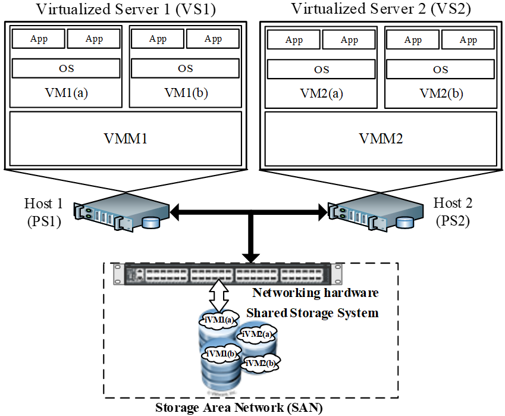
    <figcaption>Architecture of a virtualized server system (VSS).</figcaption>
  </figure>
  <figure>
    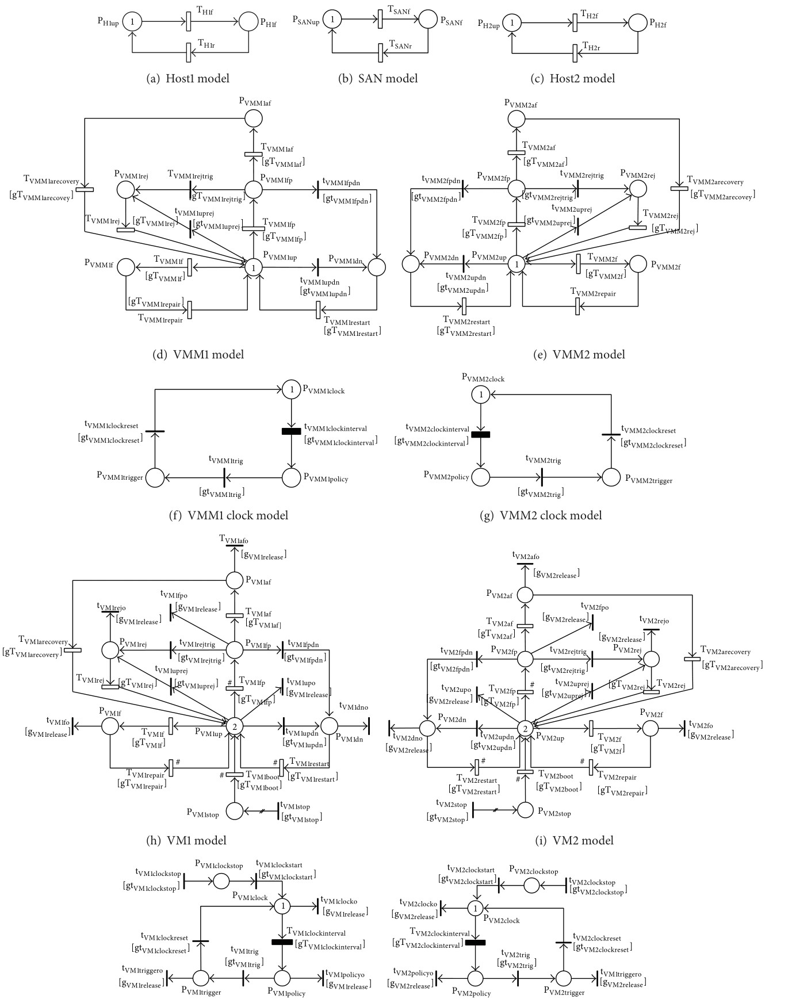
    <figcaption>SRN model of the virtualized server system.</figcaption>
  </figure>
  <figure>
    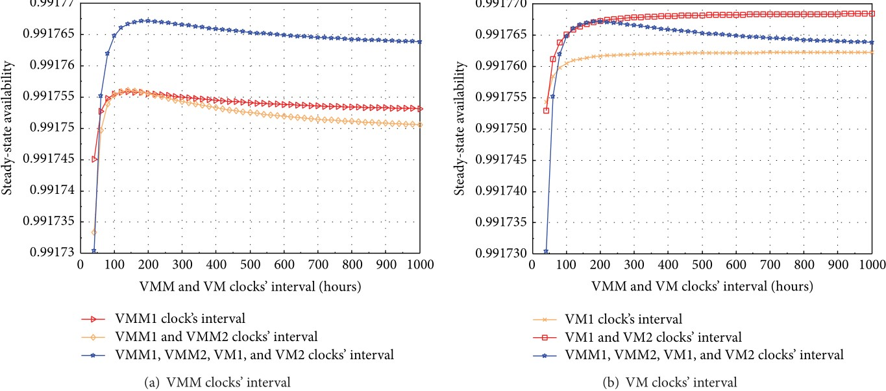
    <figcaption>Sensitivity of steady-state availability to VMM rejuvenation.</figcaption>
  </figure>
  <figure>
    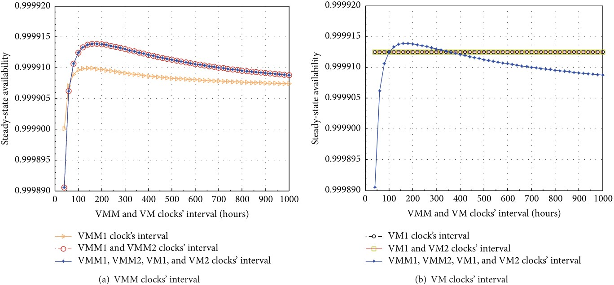
    <figcaption>Sensitivity of steady-state availability to VM rejuvenation.</figcaption>
  </figure>

### Remarks

The VSS study models four VMs running on two VMMs across two hosts, while incorporating host failures, shared storage failures, aging-related bugs, Mandelbugs, and cross-component dependencies. The resulting analysis shows that system availability depends strongly on how rejuvenation is coordinated across VMs and VMMs, providing practical guidance for operators who need to balance availability improvement against unnecessary recovery actions.

## Disaster-Tolerant Data Centers (DTDC)

Availability assessment of disaster-tolerant data centers is particularly important for cloud-based businesses that must survive site-level disruptions. This work presents a comprehensive SRN model for a geographically distributed data center architecture that combines high availability within each site and disaster tolerance across sites.

The model includes active-active operation between sites, active-passive operation within each site, backup-server support, inter-site communication failures, and dependencies between hosts, VMs, storage, and disaster events. The analysis examines availability, downtime cost, and sensitivity to parameters such as imperfect coverage and time to disaster occurrence.

### Highlights

- comprehensive availability modeling of geographically distributed data centers for disaster tolerance
- explicit treatment of disaster events, network failures, and component dependencies
- design guidance for balancing availability, downtime cost, and infrastructure cost

<figure>
  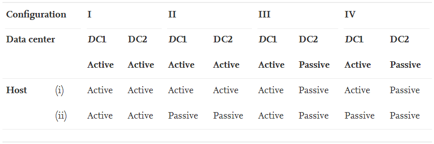
  <figcaption>Operational configurations for DTDC deployment.</figcaption>
</figure>

### Remarks

The DTDC analysis shows that disaster tolerance can significantly improve availability, but the benefit depends on the interaction between recovery coverage, network performance, and the expected frequency of disaster events. The work provides a practical basis for deciding when active-active and active-passive deployment choices are worth the operational cost.

## Internet of Medical Things (IoMT)

Modern healthcare infrastructures increasingly rely on cloud, fog, and edge systems to support continuous monitoring and decision support. This project proposes a hierarchical framework for quantifying reliability, availability, and security in Internet of Medical Things infrastructures built on a cloud-fog-edge continuum.

The framework combines a top-level fault-tree system model, subsystem-level fault-tree models, and bottom-level state-based models. This structure makes it possible to capture both architectural dependencies and detailed component-level failure and recovery behaviors. The analysis considers multiple architectural variants, recovery settings, and cyber-security attack intensities.

### Scope

- cloud member systems for analytics, storage, and data services
- fog member systems for local processing and low-latency response
- edge IoMT sensors and gateways for real-time biomedical data collection
- dependability analysis under both operational faults and cyber-security threats

  <figure>
    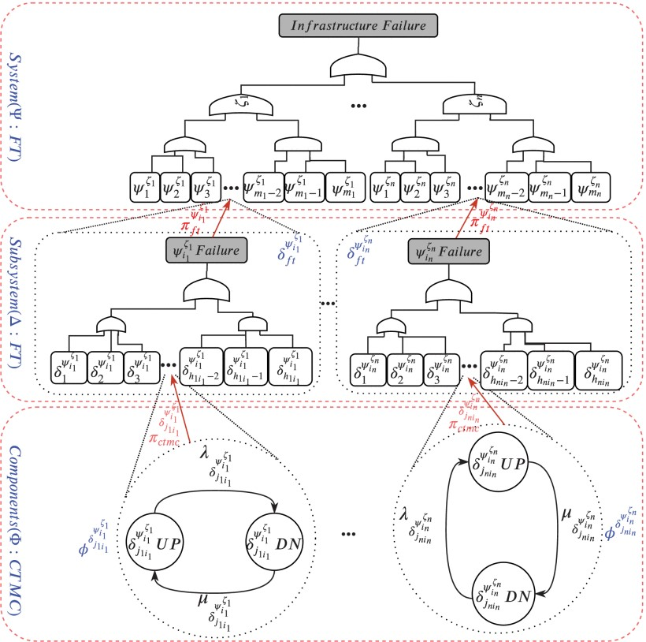
    <figcaption>Hierarchical modeling framework for IoMT infrastructures.</figcaption>
  </figure>
  <figure>
    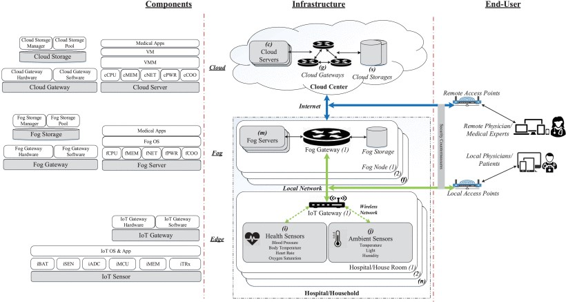
    <figcaption>Representative IoMT architecture for healthcare monitoring.</figcaption>
  </figure>
  <figure>
    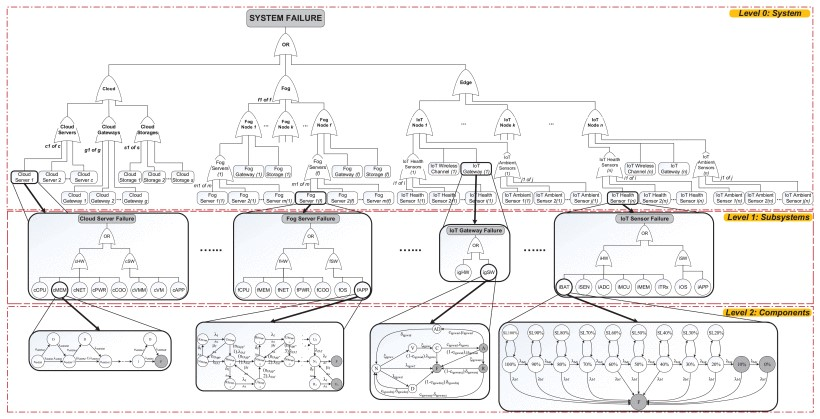
    <figcaption>Stochastic reward net model of the IoMT infrastructure.</figcaption>
  </figure>
  <figure>
    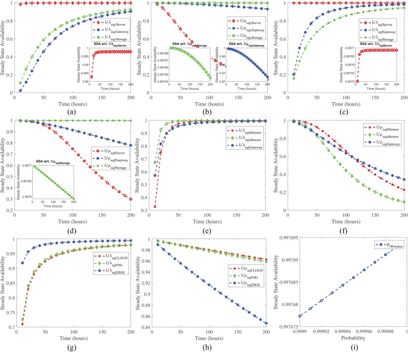
    <figcaption>Availability sensitivity analysis for IoMT deployment.</figcaption>
  </figure>

### Remarks

The IoMT work demonstrates how reliability, availability, and security can be studied together within one multi-level framework. The resulting analyses help system designers compare configurations, understand which components dominate risk, and identify where recovery or security countermeasures produce the strongest improvement in quality of service.

## Software-Defined Networks (SDN)

This project investigates the dependability impact of moving target defense (MTD) strategies in software-defined networks. While MTD can improve security by dynamically changing network behavior, it can also introduce service disruptions and performance penalties if poorly designed.

The proposed models capture time-based IP shuffling, switch-over strategies between redundant servers, DNS and controller updates, and different job-handling policies during MTD execution. The evaluation covers availability, downtime, throughput, response time, lost jobs, server utilization, and operational cost.

  <figure>
    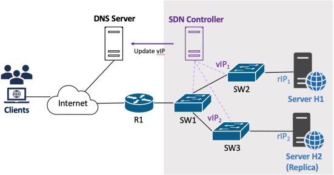
    <figcaption>Software-defined network architecture with MTD support.</figcaption>
  </figure>
  <figure>
    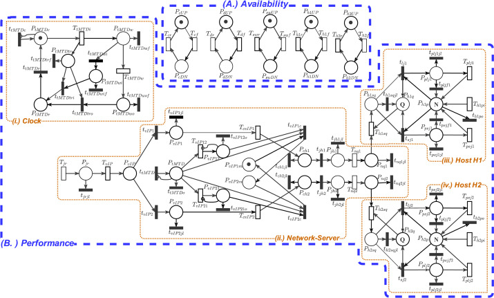
    <figcaption>SRN model of switch-over MTD strategies in SDN.</figcaption>
  </figure>
  <figure>
    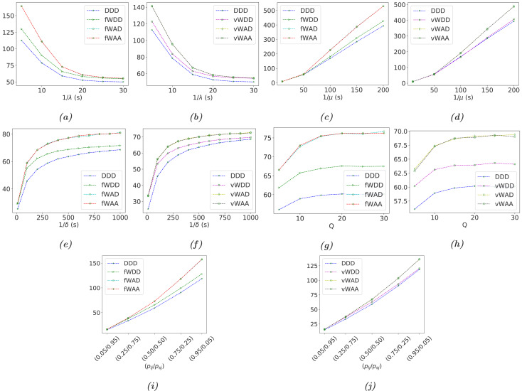
    <figcaption>Performance analysis of system response time.</figcaption>
  </figure>
  <figure>
    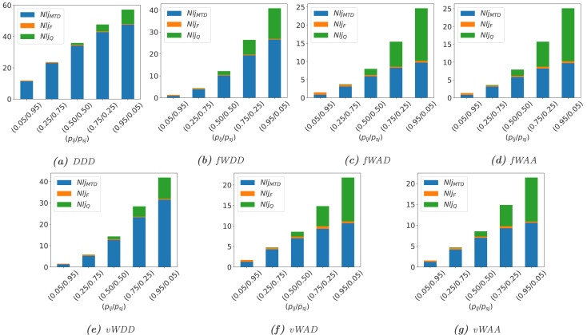
    <figcaption>Impact of MTD strategies on dropped jobs.</figcaption>
  </figure>

### Remarks

The SDN study highlights the trade-off between stronger security and stable service operation. Complete dropping policies may simplify the security posture of MTD execution, but they can also reduce throughput and worsen user-facing performance. More carefully designed waiting and acceptance policies provide a better balance between security effectiveness and performability.
