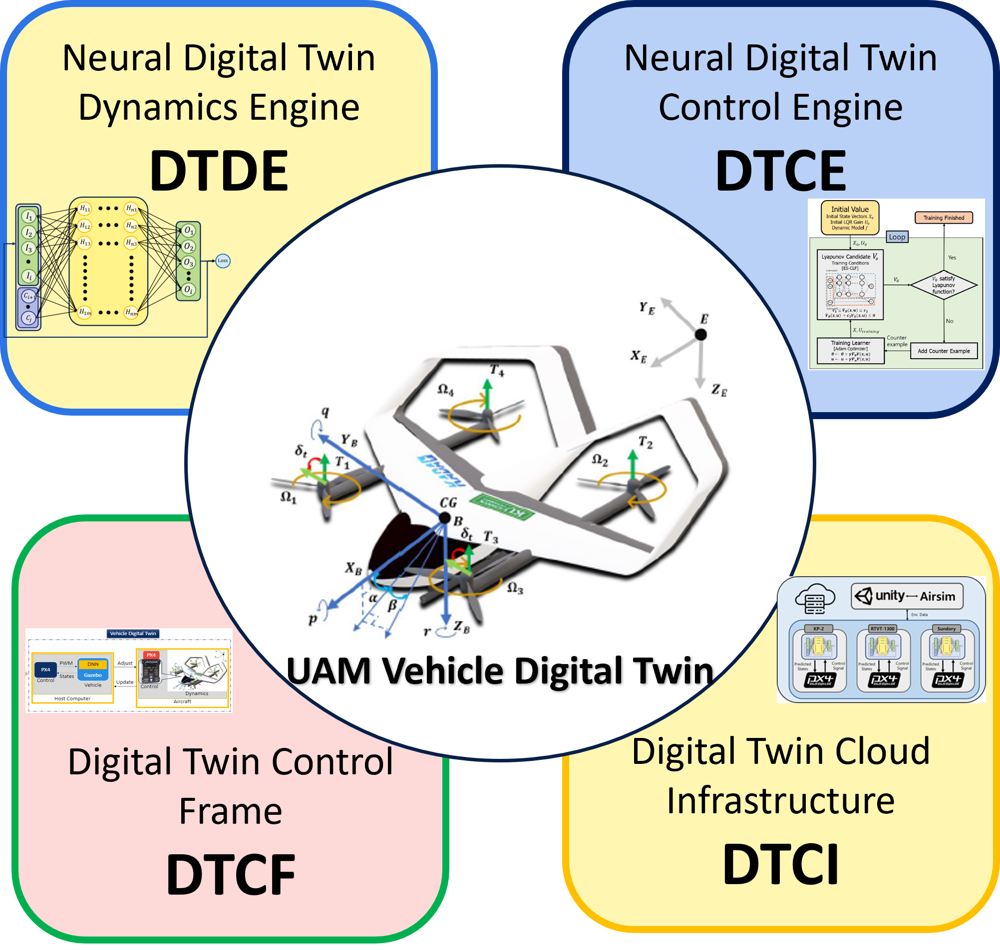
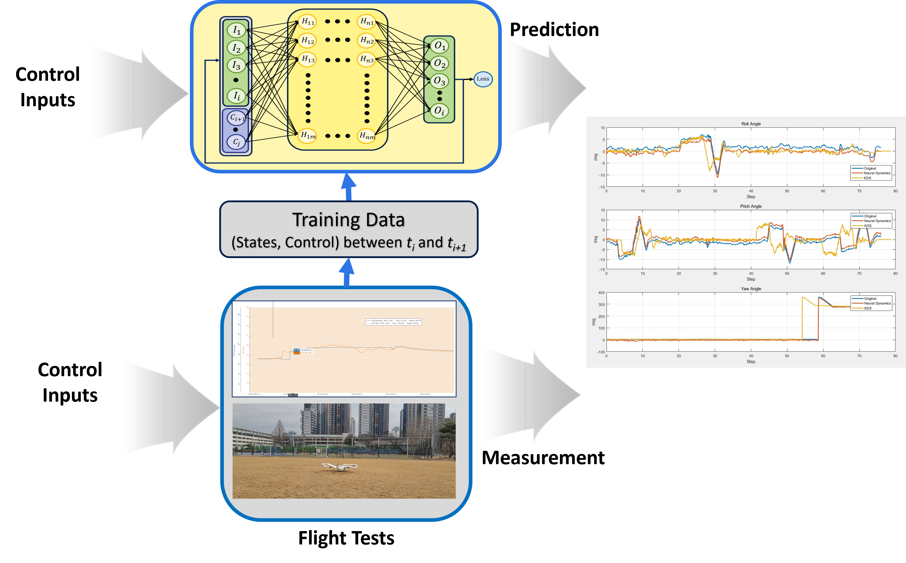
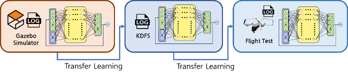
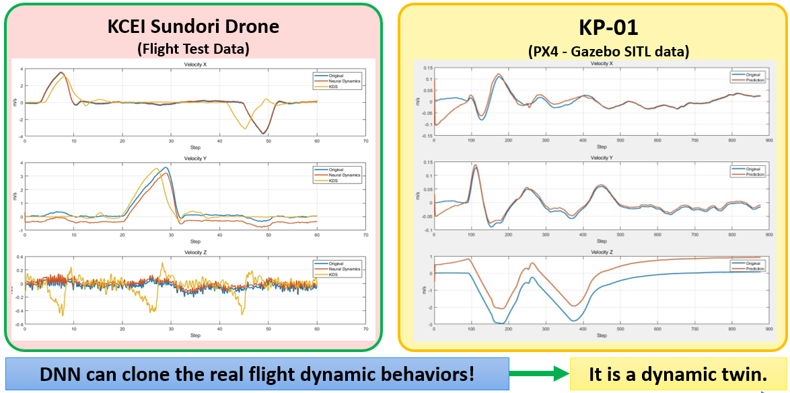
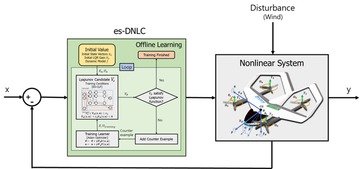
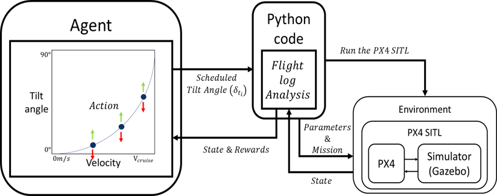
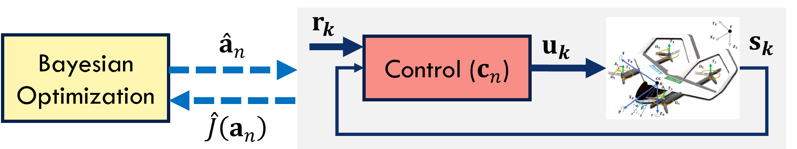
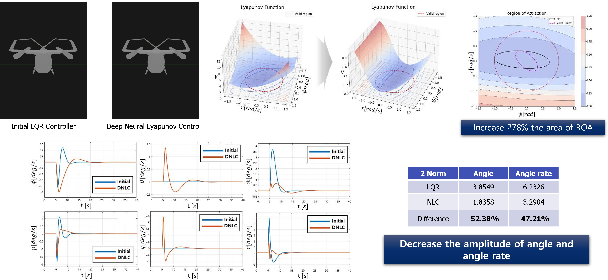
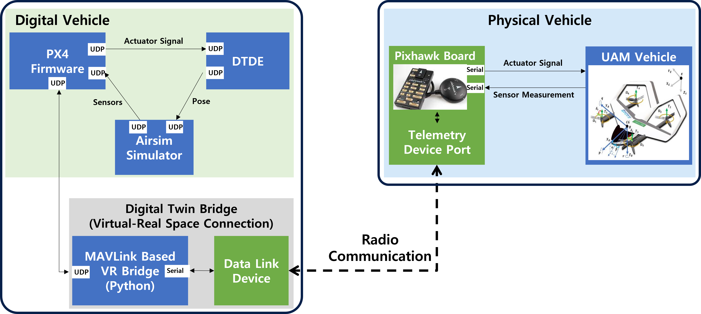
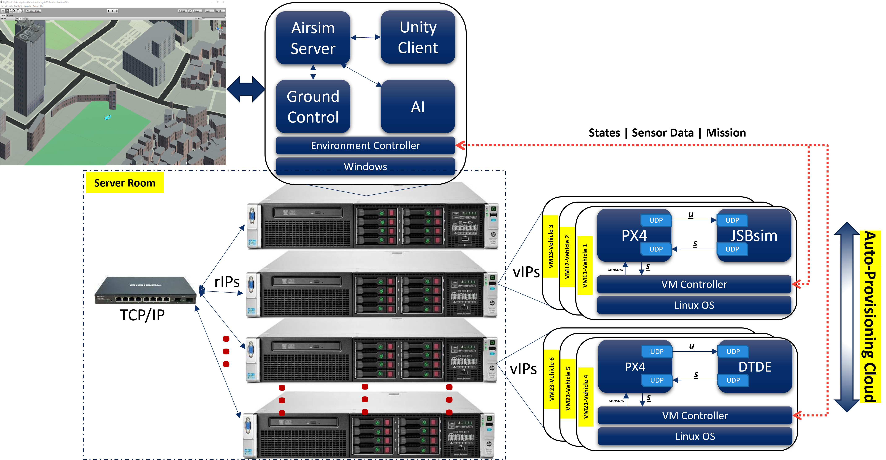

# Digital Twin Requirements

A digital twin (DT) of a vehicle is required for urban air mobility (UAM) to accurately represent the statics and dynamics of the vehicle. The adoption of a DT in the operations and control of the UAM vehicle is necessary for the UAM operational digital twin infrastructure (UAM-ODT). However, there are two major issues that need to be addressed in the development of a UAM vehicle DT: (i) the lack of DT engines for the digitalization of the dynamics and control of the UAM vehicle at the core of UAM-ODT systems, and (ii) the lack of back-end system engineering in the development of the UAM vehicle DT. This research aims to address these issues by proposing and discussing an engineering direction for the development of UAM vehicle DT engines and systems.

# Introduction

Digital twin (DT) technology has the potential to revolutionize a variety of growing industries by incorporating physics-based calculations into a feedback loop of data-driven analysis and dynamic decision-making. DTs are collections of interconnected computational models that evolve over time to mimic the underlying structure, behavior, and environment of their physical counterparts [1,2]. In this research, we explore how to develop a DT for a UAM vehicle by proposing fundamental engines for the transformation of the dynamics and control of the UAM vehicle from the real to the digital domain.

# UAM Vehicle Digital Twinization Engines

The overall architecture of a UAM operational digital twin (UAM-ODT) consists of four fundamental modules, as depicted in Figure 1: (i) neural digital twin dynamic engines (DTDE), (ii) neural digital twin control engines (DTCE), (iii) digital twin control frame, and (iv) cloud infrastructure (DTCI). The DTDE module utilizes learning-based techniques to replicate the aerodynamics of UAM vehicles. The DTCE module is responsible for control tasks, allowing for the production of robust, optimal, and adaptive control for the safety of the vehicle.

**Fig. 1. UAM Vehicle Digital Twinization Engines**

The DTDE and DTCE modules will digitalize the dynamics and control of the vehicle, ensuring that the operations in both the digital and physical worlds are identical. The DTCF module serves as a bridge connecting the physical and digital twins of the vehicle and can provide teleoperation services, fault-tolerant control, or traffic prediction and management. If the physical vehicle's dynamics and control are accurately represented in the digital space, along with the digital environment (such as cities, regions, and countries), the operations in the digital space can be applied to the physical space. The UAM-ODT system as a whole runs continuously on the DTCI module to create a virtual representation of the actual UAM physical infrastructure.

# Digital Twin Dynamics Engine (DTDE)

To digitalize the dynamics of a vehicle, we propose the development of a deep learning-based dynamics engine in the form of a deep neural network (DNN) that can accurately capture the real behavior of vehicle dynamics, as shown in Figure 2. The DNN (shown in Figure 2(a)) is trained on real flight test data in manual control mode to learn the relationship between control inputs and response states, which represents the real vehicle dynamics.

*(a) Neural Dynamics Engine*

*(b) Transfer Learning for Fidelity Improvement*

*(c) Dynamics prediction*

**Fig. 2: Digital Twin Dynamics Engines (DTDE)**

To improve the coverage of training data and enhance the fidelity of the dynamics engine, we utilize transfer learning, as shown in Figure 2(b). This technique allows us to use simulation models of different levels of fidelity to provide sufficient operational flight modes. Initial results in Figure 2(c) indicate that our approach can accurately replicate the flight dynamics of a hexacopter drone and a KP-01 eVTOL vehicle (under development at the Konkuk Aerospace Design-Airworthiness Institute at Konkuk University in South Korea) based on both simulation data and real flight test data.

# Digital Twin Control Engine (DTCE)

The control algorithms of the real vehicle are encapsulated in the DTCE module, which includes:

(i) Robust control, using exponential stabilization of deep neural network control with Lyapunov functions (es-DNLC) for attitude stabilization of PAVs, as shown in Figure 3(a).

(ii) Optimal control, using reinforcement learning to find the optimal tilting strategy during the transition mode, as depicted in Figure 3(b).

(iii) Adaptive control, which optimizes control parameters using Bayesian optimization and Gaussian processes for dynamics representation, as shown in Figure 3(c).

Preliminary results in Figure 3(d) indicate that our deep learning-based control with Lyapunov stability can provide a high level of robustness for operational flights (attitude stabilization) of the UAM vehicle KP-01.

*(a) es-DNLC*

*(b) Tiltiing Optimization using RL*

*(c) Bayesian optimization of controller*

*(d) Preliminary results of deep neural Lyapunov control*

**Fig. 3: Digital Twin Control Engine (DTCE)**

# Digital Twin Control Frame (DTCF)

It is believed that the DTDE, and DTCE can capture exactly how the physical vehicle can fly in the real space. At this time, the control in the digital space can be adopted for the real-world operations of the physical vehicle in the physical space. Tele-operations and fail-safe flights can be developed through the DTCF module in Fig. 4.  A bridge for virtual-real space connection is developed using MAVLink API to transmit and receive aerospace data between the physical-digital vehicles in asynchronous and irregular manner.

**Fig. 4: Digital Twin Control Frame (DTCF)**

# Digital Twin Cloud Infrastructure (DTCI)

The above modules are for the DT development of a single UAM vehicle. To develop the UAM-ODT system for a huge number of vehicles, a cloud infrastructure is involved for the deployment of nucleus cores of **[dynamics and control]** of heterogeneous vehicles as shown in Fig. 5.

**Fig. 5: Digital Twin Cloud Infrastructure (DTCI)**

# Remarks

This research proposes and discusses an overall engineering direction for the development of UAM vehicle digital twin system. Preliminary results prove that the approaches can clone the dynamics and control of UAM vehicles for the development of UAM-ODT.

# References

[1] T.A. Nguyen, S.W. Jeon, A.A. Maw, D.K. Min, J.W. Lee, (2020), “Toward dependable blockchain and AI engines of digital twin systems for urban air mobility”, The Korean Society for Aeronautical & Space Sciences, 한국항공우주학회 학술발표회 초록집, 2021.07, 408-409.

[2] T.A. Nguyen, J. Li, M. Jang, A.A. Maw, V. Pham, J.W Lee, (2022), “Cloud-in-the-loop simulation: A cloud-based digital twin HW/SW framework for multi-mode AI control simulation of eVTOL KADA-UAM Personal Aerial Vehicles”, The Korean Society for Aeronautical & Space Sciences, 한국항공우주학회 학술발표회 초록집, 2022.04, 138-139.

[3] M. Jang, J. Hyun, T.A. Nguyen, J.W. Lee, (2022), “Attitude Stabilization of eVTOL in Hovering Mode using Neural Network based Control with Lyapunov Theorem”, The Korean Society for Aeronautical & Space Sciences, 한국항공우주학회 학술발표회 초록집, 2022.04, 322-323.
