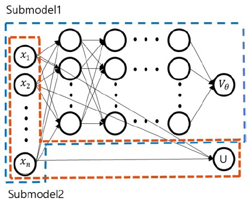
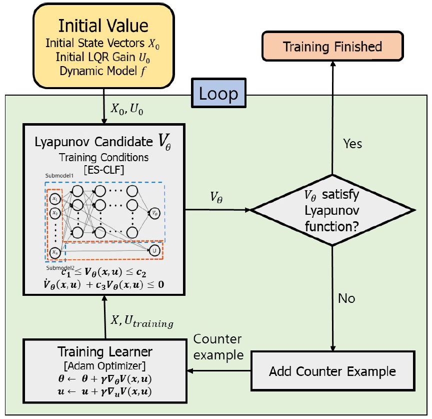
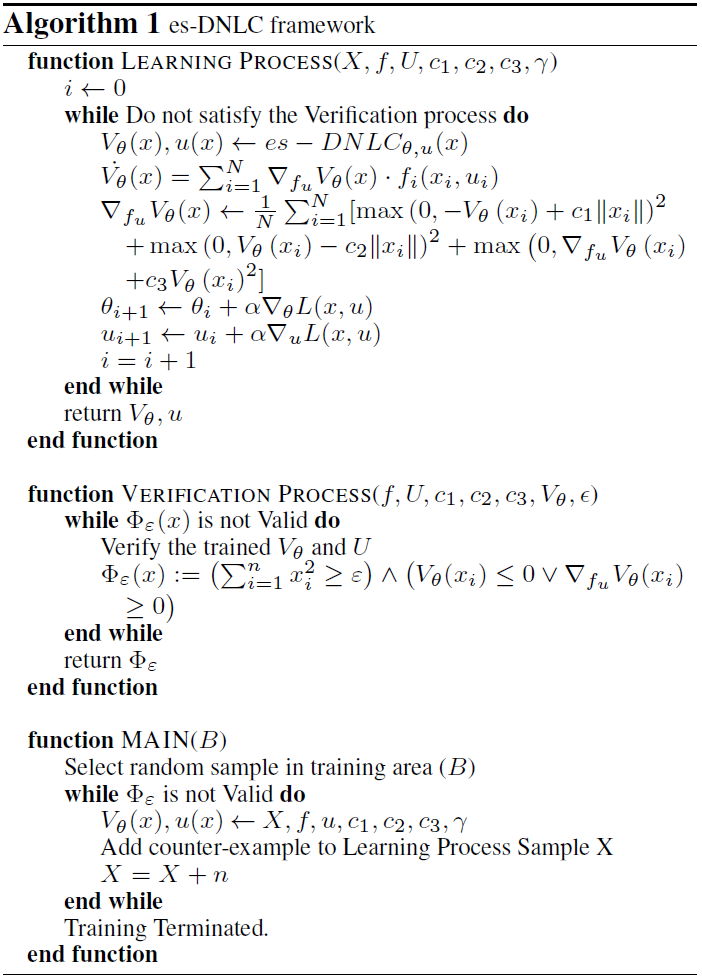
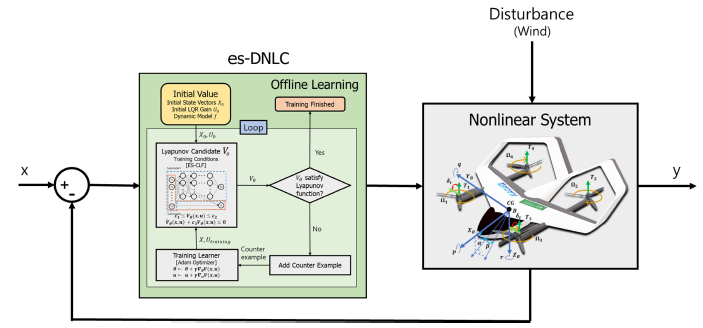
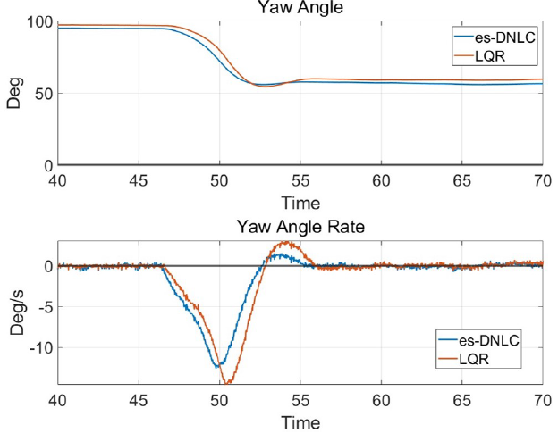
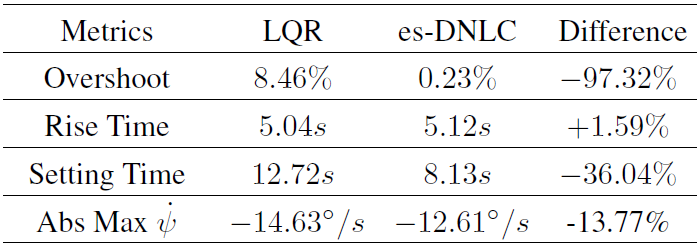

#  style="font-size:14px" es-DNLC: A Deep Neural Network Control with Exponentially Stabilizing Control Lyapunov Functions for Attitude Stabilization of PAV 

### Abstract

Attitude stabilization is of paramount importance in the flight control of personal aerial vehicle (PAV) in the future urban air mobility (UAM). This study proposes to adopt a deep neural network (DNN) with exponentially stabilizing control Lyapunov functions (es-CLF) as a control framework (called, es-DNLC) for the stabilization of a KP-1 eVTOL PAV in multi-copter mode. The es-DNLC uses exponentially stabilizing control Lyapunov Function(es-CLF) as a learning policy in the DNN training to guarantee the robustness against disturbances. The robustness is enhanced and verified by an area increase of region of attraction (ROA) after adopting the trained DNN into the KP-1 control system. We implemented the proposed control framework in an open source autopilot system (PX4) along with software in the loop (SITL) in Gazebo simulator in which a wind gust is injected as a sudden disturbance in the simulation. A wind tunnel test was performed to increase the accuracy of the Gazebo simulation by utilizing high-fidelity propulsion data of the KP-1's motors. The effectiveness of the adopted control framework is compared with linear quadratic regulator (LQR) which is also the initial control of es-DNLC before training. The finding of this study shows that es-DNLC compared to LQR can guarantee a higher level of robustness of the system against disturbances and aerodynamic uncertainties.

***DNN structure of the es-DNLC***

***es-DNLC Training Diagram***

***es-DNLC Framework***

***es-DNLC Controller Diagram***

***Result of disturbance in Yaw angle/angular rate***

***Yaw angle responses in LQR and es-DNLC***

### Remarks

In contrast to employing locally asymptotic Lyapunov functions as a learning strategy, es-DNLC is developed in this paper by adopting es-CLF, which significantly guarantee stability and robustness. And a KP-1 multi-copter mode attitude controller is designed for the purpose of stabilising attitude. When comparing the ROA sizes of the LQR and es-DNLC, it can be shown that es-DNLC has a bigger ROA and therefore, provides stability against external disturbances. Additionally, the PX4-Gazebo SILS was built, and testing revealed that the suggested framework performs better than the LQR regarding robust attitude stabilization. Future works consider the complete development of a neural dynamic and control system for a digital twin of the KP-1 vehicle.
