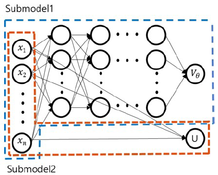
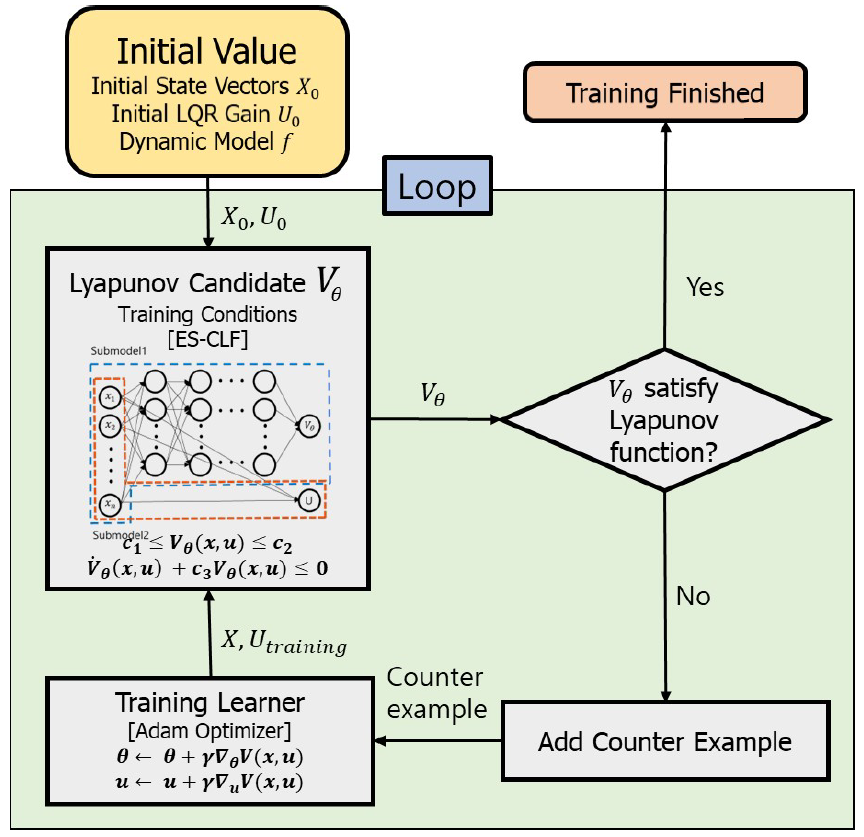
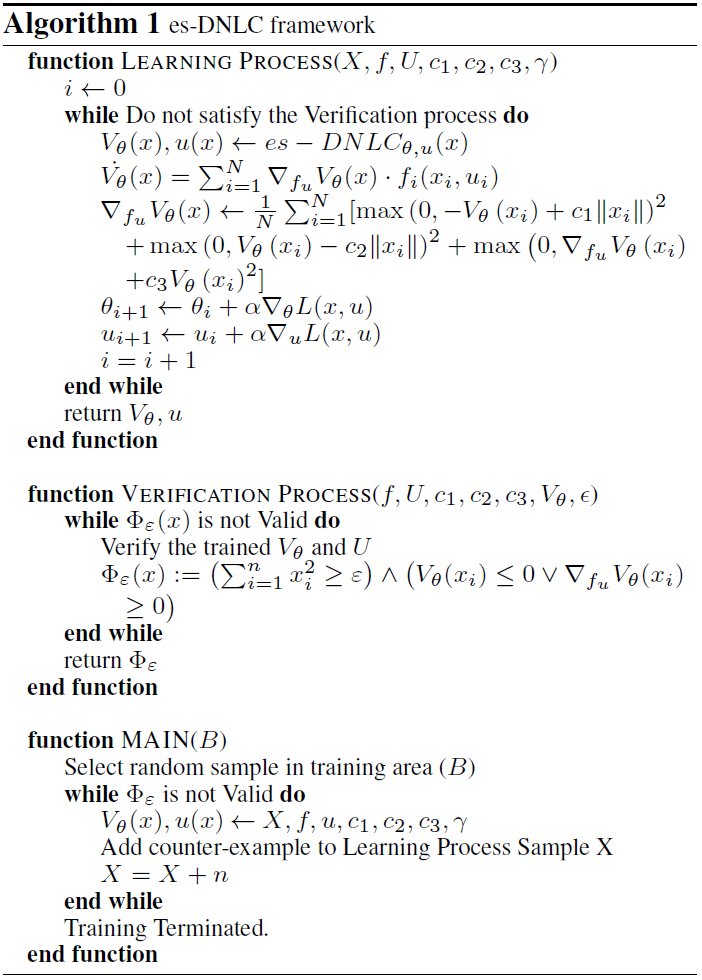
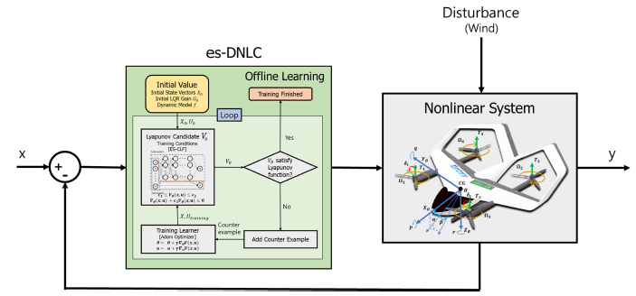
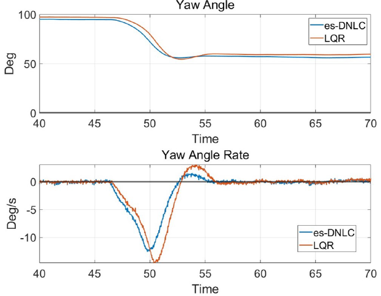
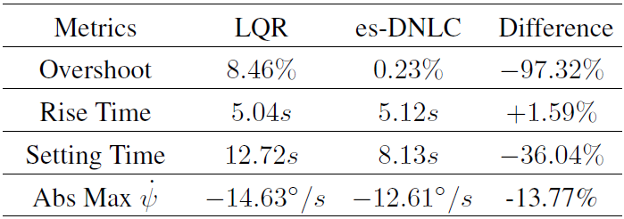

  
This research direction explores data-driven dynamics, learning-enabled control, and stability-aware autonomy for aerial and robotic systems. A representative project is <strong>es-DNLC</strong>, a deep neural control framework that combines learning with exponentially stabilizing control Lyapunov functions for robust attitude stabilization.

## es-DNLC for Attitude Stabilization of PAV

### Abstract

Attitude stabilization is of paramount importance in the flight control of personal aerial vehicle (PAV) in the future urban air mobility (UAM). This study proposes to adopt a deep neural network (DNN) with exponentially stabilizing control Lyapunov functions (es-CLF) as a control framework (called, es-DNLC) for the stabilization of a KP-1 eVTOL PAV in multi-copter mode. The es-DNLC uses exponentially stabilizing control Lyapunov Function(es-CLF) as a learning policy in the DNN training to guarantee the robustness against disturbances. The robustness is enhanced and verified by an area increase of region of attraction (ROA) after adopting the trained DNN into the KP-1 control system. We implemented the proposed control framework in an open source autopilot system (PX4) along with software in the loop (SITL) in Gazebo simulator in which a wind gust is injected as a sudden disturbance in the simulation. A wind tunnel test was performed to increase the accuracy of the Gazebo simulation by utilizing high-fidelity propulsion data of the KP-1's motors. The effectiveness of the adopted control framework is compared with linear quadratic regulator (LQR) which is also the initial control of es-DNLC before training. The finding of this study shows that es-DNLC compared to LQR can guarantee a higher level of robustness of the system against disturbances and aerodynamic uncertainties.

### Representative Figures

  <figure>
    
    <figcaption>DNN structure of the es-DNLC framework.</figcaption>
  </figure>
  <figure>
    
    <figcaption>Training process for the es-DNLC controller.</figcaption>
  </figure>
  <figure>
    
    <figcaption>End-to-end es-DNLC framework.</figcaption>
  </figure>
  <figure>
    
    <figcaption>Controller architecture for deployment.</figcaption>
  </figure>
  <figure>
    
    <figcaption>Yaw-angle stabilization under disturbance.</figcaption>
  </figure>
  <figure>
    
    <figcaption>Response comparison between LQR and es-DNLC.</figcaption>
  </figure>

### Remarks

In contrast to employing locally asymptotic Lyapunov functions as a learning strategy, es-DNLC adopts exponentially stabilizing control Lyapunov functions to strengthen both stability and robustness. The resulting KP-1 multi-copter attitude controller shows a larger region of attraction than the baseline LQR controller, providing stronger tolerance against disturbances and aerodynamic uncertainties. Future work extends this line toward a full neural dynamics-and-control stack for the digital twin of the KP-1 vehicle.
